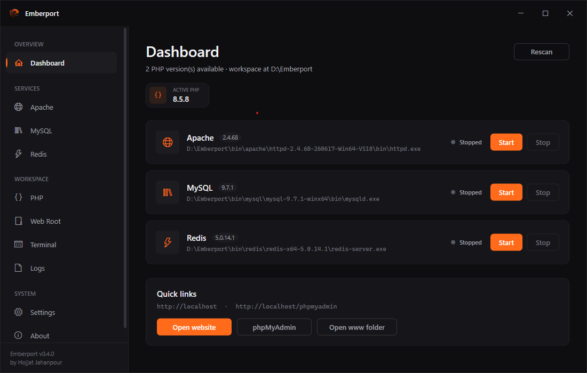
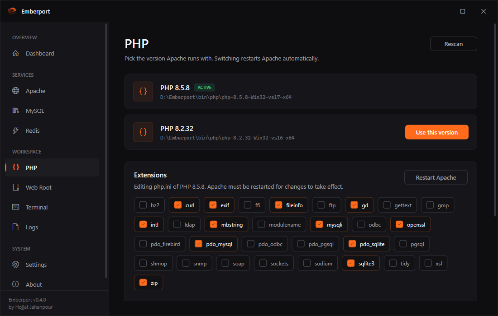
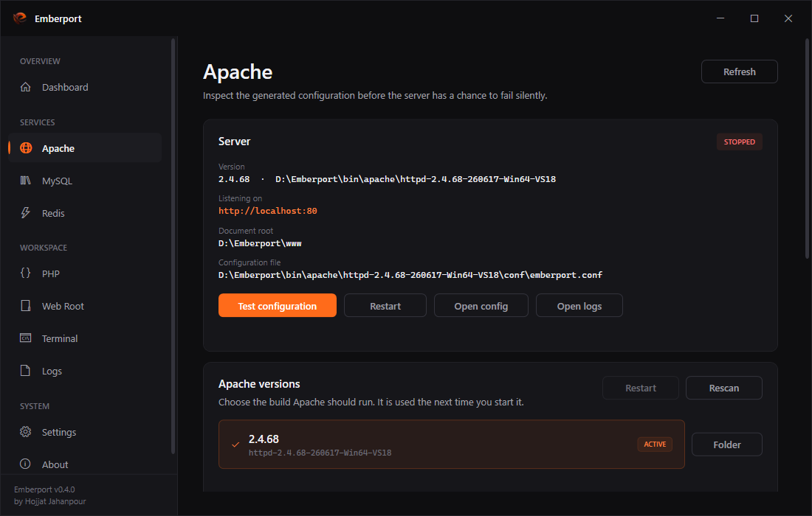

<div align="center">


# Emberport

**DEPLOY. MANAGE. IGNITE.**

A modern, dark, minimal local web development environment for Windows.<br>
Apache, PHP, MySQL, Redis and phpMyAdmin in one installer, with real version switching.

[](LICENSE)
[](https://dotnet.microsoft.com/)
[](#requirements)
[](https://github.com/hojjatjh/Emberport/releases/latest)
[](https://github.com/hojjatjh/Emberport/releases)
[](https://github.com/hojjatjh/Emberport/stargazers)

[Download](https://github.com/hojjatjh/Emberport/releases/latest) &nbsp;·&nbsp; [Getting started](#getting-started) &nbsp;·&nbsp; [Features](#features) &nbsp;·&nbsp; [FAQ](#faq)

</div>

---

## Screenshots

<div align="center">



<table>
<tr>
<td></td>
<td></td>
</tr>
</table>

</div>

---

## Why Emberport

**Everything is already in the box.** One installer brings Apache, PHP, MySQL, Redis and phpMyAdmin. Install it, press Start, open `http://localhost`. Nothing to download, nothing to wire up.

**You still own the binaries.** The bundled servers are ordinary portable builds sitting in `bin\`. Drop another PHP or MySQL release next to them and Emberport picks it up on the next scan. Nothing is hidden, nothing is patched, no vendor lock-in.

**The servers cannot outlive the app.** Every process is attached to a Windows job object. Kill Emberport from Task Manager, from the debugger, or by pulling the plug, and Apache, MySQL and Redis go down with it. No orphaned `mysqld.exe` holding port 3306 hostage.

**It tells you why something failed.** When a service refuses to start, Emberport reads the log, checks the port, checks the data directory, checks the thread safety of the PHP build, and shows the actual reason on the page. Not a red dot.

---

## Features

| | |
|---|---|
| **Apache** | Start, stop, live status, generated configuration, custom port |
| **PHP** | Switch versions with one click, thread safety detection, active build shown everywhere |
| **php.ini** | Enable and disable extensions from a list, duplicates collapsed automatically |
| **MySQL** | Switch versions, automatic first run initialisation, custom port |
| **Backups** | Streaming `mysqldump` for large databases, optional gzip, live progress, cancellable |
| **Redis** | Switch versions, start, stop, custom port |
| **phpMyAdmin** | Preconfigured and kept in sync with the MySQL port |
| **Document root** | Serve any folder on any drive, exactly like Laragon |
| **Ports** | Change Apache, MySQL and Redis ports, with conflict detection before launch |
| **Logs** | Built in viewer for every service log, with clear and open in explorer |
| **Terminal** | Opens a shell with the active PHP and MySQL already on the PATH |
| **Health checks** | Per service diagnosis that explains failures in plain language |
| **Notification area** | Closing hides to the tray, start and stop services from the tray flyout |
| **Start with Windows** | Optional, launches hidden in the tray |

---

## Requirements

- Windows 10 version 1809 (build 17763) or newer, 64 bit
- [Visual C++ 2015-2022 Redistributable (x64)](https://aka.ms/vc14/vc_redist.x64.exe) — the installer checks for it and offers the download if it is missing
- Administrator rights **once**, during installation only
- No .NET installation needed, the runtime ships with the app

### Bundled builds

| Component | Version |
|---|---|
| Apache | 2.4.68 (Apache Lounge, VS18 x64) |
| PHP | 8.5.8 and 8.2.32 (Thread Safe, x64) |
| MySQL | 9.7.1 |
| Redis | 5.0.14.1 (tporadowski build) |
| phpMyAdmin | latest stable at release time |

---

## Getting started

1. Download **`Emberport-1.0.0-setup.exe`** from the [latest release](https://github.com/hojjatjh/Emberport/releases/latest).
2. Run it. Windows SmartScreen will warn about an unknown publisher because the installer is not code signed — choose **More info → Run anyway**.
3. Pick an install folder. The default is `C:\Emberport`. Program Files is intentionally avoided: the servers write to their own folders and a path without spaces keeps Apache happy.
4. Choose what to install:
   - **Full** — everything, including MySQL and Redis
   - **Compact** — Apache, PHP and phpMyAdmin only
   - **Custom** — pick per component
5. Launch Emberport and press **Start** on the dashboard.
6. Open `http://localhost` for your site and `http://localhost/phpmyadmin` for the database.

Put your projects in `www\`, or point the document root at any folder you like from the **Web Root** page.

> The very first MySQL start initialises the data directory and can take 20 to 60 seconds. It only happens once.

### Adding your own builds

The bundled servers are not special. Extract any portable build into its folder and press **Rescan**:

```
bin\php\php-8.4.10-Win32-vs17-x64\php.exe
bin\mysql\mysql-8.4.5-winx64\bin\mysqld.exe
```

PHP must be a **Thread Safe** build, because Apache loads it as a module.

| Component | Where to download |
|---|---|
| PHP | https://windows.php.net/download |
| Apache | https://www.apachelounge.com/download/ |
| MySQL | https://dev.mysql.com/downloads/mysql/ |
| Redis | https://github.com/tporadowski/redis/releases |
| phpMyAdmin | https://www.phpmyadmin.net/downloads/ |

---

## Installed layout

```
C:\Emberport\
├── Emberport.exe
├── bin\
│   ├── apache\httpd-2.4.68-...\
│   ├── php\php-8.5.8-...\
│   ├── mysql\mysql-9.7.1-winx64\
│   └── redis\redis-x64-5.0.14.1\
├── tools\phpmyadmin\
├── www\            your sites
├── data\           MySQL data directory
├── config\         settings.json, generated configuration
└── backups\        database dumps
```

Uninstalling removes the application and the bundled servers. `www\`, `data\` and `backups\` are deliberately left behind — an uninstall must never destroy your work.

---

## Configuration

| Setting | Default | Where |
|---|---|---|
| Apache port | 80 | Settings |
| MySQL port | 3306 | Settings |
| Redis port | 6379 | Settings |
| Document root | `www\` | Web Root |
| MySQL user | `root`, no password | fixed, local only |
| Start with Windows | off | Settings or tray |

Everything is stored in `config\settings.json`. Delete it and Emberport starts fresh.

---

## Backups

The MySQL page can dump every database without loading anything into memory. `mysqldump` output is streamed straight to disk in one megabyte chunks, optionally through gzip, so a database far larger than the available RAM backs up fine.

- `--single-transaction --quick --skip-lock-tables`, so a dump does not block a running site
- Free disk space is checked against an estimate before the dump starts
- Written to a `.part` file first and renamed only on success, so a cancelled or crashed run never leaves a file that looks valid
- Live progress, and cancel actually kills the child process

Restore a dump with:

```cmd
mysql --host=127.0.0.1 --port=3306 --user=root < emberport-2026-07-28_18-30-00.sql
```

---

## Building from source

Requires the [.NET 8 SDK](https://dotnet.microsoft.com/download/dotnet/8.0). Visual Studio 2022 is recommended but not required.

```cmd
git clone https://github.com/hojjatjh/Emberport.git
cd Emberport
dotnet build
dotnet test
```

Running from the repository uses the repository folder as the workspace, so drop your server builds into `bin\` and everything behaves like an installed copy.

### Building the installer

Needs [Inno Setup 6](https://jrsoftware.org/isdl.php).

```cmd
dotnet publish src\Emberport.App\Emberport.App.csproj -c Release -r win-x64 --self-contained true -o publish
"C:\Program Files (x86)\Inno Setup 6\ISCC.exe" installer\Emberport.iss
```

The result lands in `dist\`. The script bundles whatever is currently in `bin\` and `tools\`, minus everything Emberport generates at runtime.

### Tests

The test project covers the two places where a bug would quietly corrupt something the user owns: the `php.ini` extension editor and the welcome interval logic. Tests run against temporary folders and never touch a real installation. Thirty one focused tests are worth more than two hundred that assert nothing.

---

## FAQ

**Is there a portable version?**<br>
Yes. Copy the installed folder anywhere, including a USB drive. Emberport resolves its workspace from the folder the executable sits in and recreates anything missing.

**Why not a single exe?**<br>
It was tried. WPF has to unpack its native libraries at runtime from a single file bundle, which fails on some machines with a silent crash. A proper installer is faster to start and far more reliable.

**Can it run next to Laragon or XAMPP?**<br>
Only one of them at a time. They compete for ports 80 and 3306. Stop the other one first, or change Emberport's ports in Settings.

**Does uninstalling delete my databases?**<br>
No. `data\`, `www\` and `backups\` are left on disk.

**Windows says the publisher is unknown.**<br>
The installer is not code signed, because a certificate costs a few hundred dollars a year. Every release ships a SHA256 checksum and the source is right here.

**Does it need to run as administrator?**<br>
Only the installer, once, to create the folder and grant write access. The app itself runs as a normal user.

---

## Roadmap

- Virtual hosts with automatic `.test` domains
- HTTPS with locally trusted certificates
- Nginx as an alternative to Apache
- PostgreSQL and Mailpit
- Composer and Node on the temporary PATH

---

## Contributing

Issues and pull requests are welcome. Keep changes focused, match the existing style, and add a test when the change touches something that writes to disk.

## License

Emberport is released under the [MIT License](LICENSE).

The bundled servers keep their own licenses and are redistributed unmodified. See [THIRD-PARTY-NOTICES.txt](installer/THIRD-PARTY-NOTICES.txt) for the full list.

---

<div align="center">

Built by **Hojjat Jahanpour** &nbsp;·&nbsp; [github.com/hojjatjh](https://github.com/hojjatjh)

If Emberport saves you time, a star costs nothing and helps a lot.

</div>
